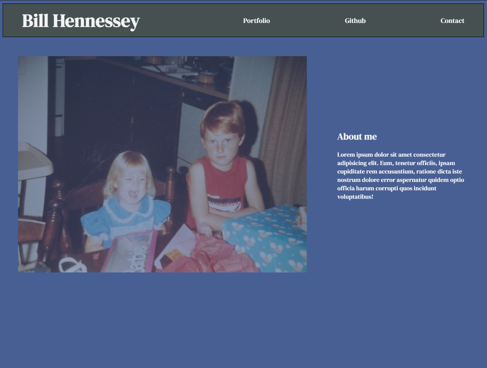

# 2-Portfolio

## Description
This is my Portfolio page, and the first web page I have written soup-to-nuts in my life. I am very excited about it. 

In its current state is has not actual content to link to. But over time I will add to it and style it to make it more of my own.

I learned so much writing this simple little page. I learned how to utilize flexbox to organize content. I also learned how to apply different content styles and structure based on the size of the viewbox with a media query. I also learned that tasks like this are not too big for me.


## Installation
There is nothing to install for this project. Simply visit the following link to my Github page:  
https://bill-hennessey.github.io/2-Portfolio/

## Usage
This will be used when employers and anyone else would like to see some of the work I've been doing. 

    ```md
    
    ```
## Credits
I had no direct collaborators for this project. I would like to thank my bootcamp instructor Ben Machok, as well as W3 Schools (https://www.w3schools.com/) for their tutorials on Media Queries, background images styling, flexbox, and many more.
## License
There is no need for licensing of this project.